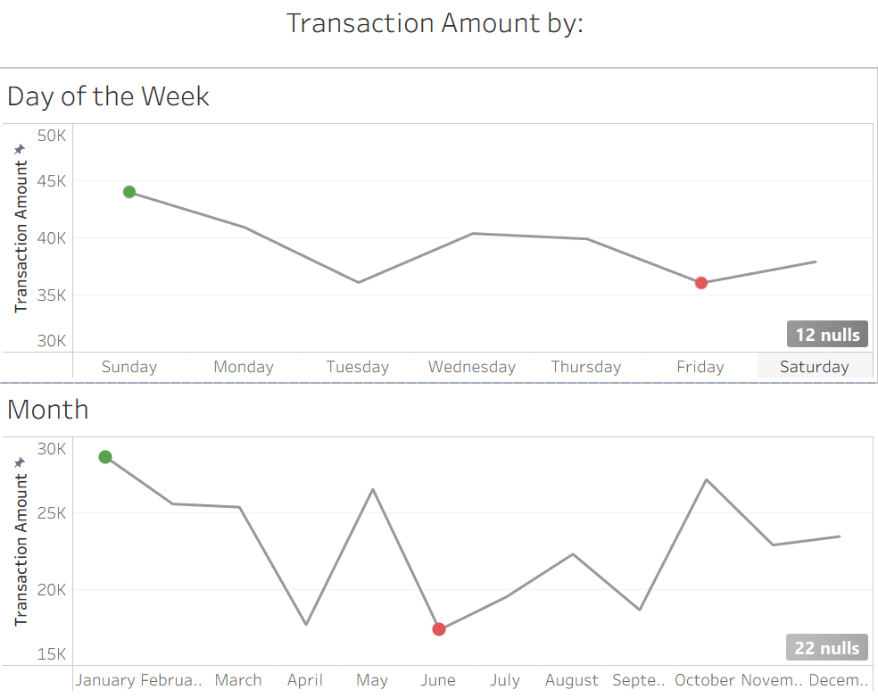

# Restaurant Sales Analysis

This project analyzes one year of sales data from a small fast-food restaurant to uncover trends in customer behavior, revenue patterns, and operational performance.  
The goal was to answer real business questions such as:

- **What factors influence customer spending?**
- **When does the restaurant make the most (and least) money?**
- **Which products and payment methods drive profit?**
- **What operational changes could increase revenue?**

This project includes **data cleaning**, **exploratory analysis**, **Tableau dashboards**, and **SQL business queries**.

---

## Tools Used
- **Excel** — initial formatting and data revie
- **MySQL** — data cleaning + analysis  
- **Tableau** — dashboards + visual analysis  

---

## Key Insights
- **Weekends generate the highest revenue**, with **Sunday** performing best.  
- **Afternoon has the most transactions**, while **night sales** produce higher profit per purchase.  
- **Sandwiches generate the most revenue** of all menu items.  
- **Cold Coffee leads online purchases**, showing strong digital demand.  
- **Fridays are the lowest-revenue day**, suggesting an opportunity to adjust hours or staffing.  
- **Male customers spend slightly more per transaction** than female customers.

---

## 📈 Example Visualization

# Revenue by Day of the Week & Month



---

## Data Cleaning Summary

Key preprocessing steps:

- Converted prefixes (“Mr.”, “Ms.”, “Mrs.”) into a clean **gender** field.  
- Split the date column into **Year**, **Month**, and **Day of Week**.  
- Filled missing `transaction_type` values with **“Gift Card”**.  
- Converted price and amount fields into numeric types.  
- Created a **Profit** column:  
  `profit = 0.7 * transaction_amount` (assuming 30% operational cost)

---

## Example SQL Queries

### **1. Top Revenue-Generating Items**
```sql
SELECT item_name, SUM(transaction_amount) AS total_revenue
FROM food_sales
GROUP BY item_name
ORDER BY total_revenue DESC;
```

### **2. Average Spending by Gender**
```sql
SELECT gender, AVG(transaction_amount) AS avg_spend
FROM food_sales
GROUP BY gender;
```

### **3. Highest Revenue Day of the Week**
``` sql
SELECT day_of_week, SUM(transaction_amount) AS total_revenue
FROM food_sales
GROUP BY day_of_week
ORDER BY total_revenue DESC;
```

## Next Steps
With additional data, such as customer age, ingredient cost, marketing spend, or multiple store locations, future expansions could include:
- Analyze More Customer Demographics
- Predictive forecasting for sales volume
- Profit modeling by cost-of-goods and labor data
